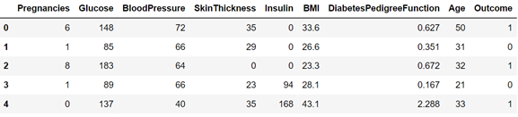
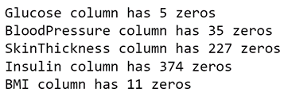
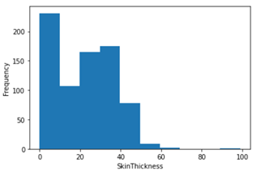
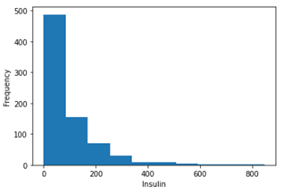
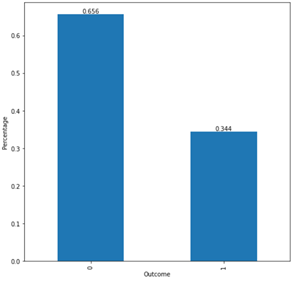
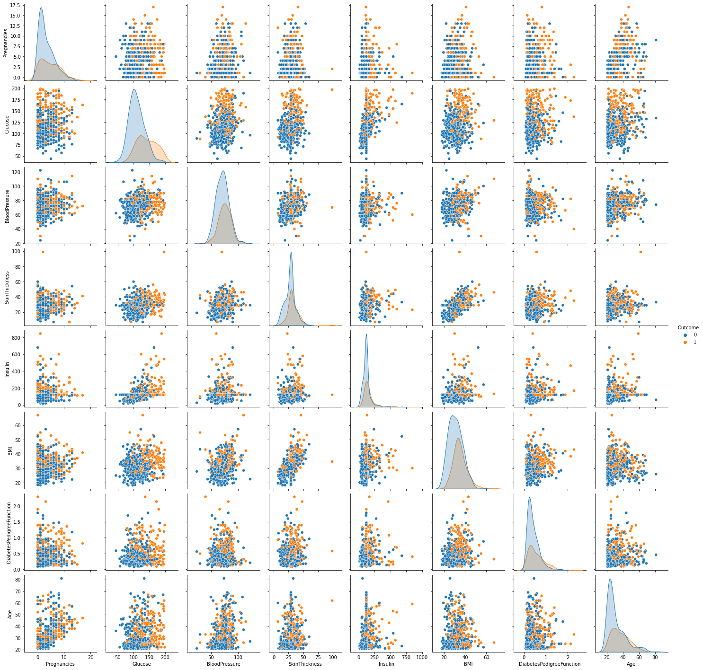
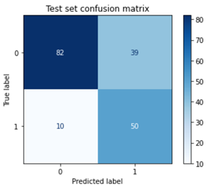
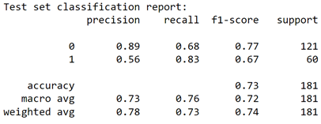
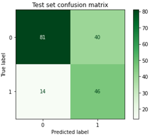
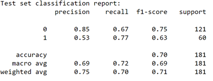

# Diagnosing Patients with Type 2 Diabetes: Project Overview
* Trained a classifer to predict whether a patient has Type 2 diabetes or not (f1-score = 0.67, recall = 0.83, precision = 0.56 \*\*positive class\*\*), so doctors can have assistance in diagnosing patients
* The dataset used to train the model was accessed from [Kaggle](https://www.kaggle.com/uciml/pima-indians-diabetes-database). All patients in the dataset are females, at least 21 years old, and of Pima Indian heritage.
* 768 patients (before removing observations from dataset)
* Identified missing values that were recorded as zeros and dropped/imputed them
* Used SMOTE to handle class imbalance (66% negative cases, 34% positive cases)
* Created a pairplot with response as category to see if data was linealry separable
* Created a pipeline with imblearn library for necessary preprocessing steps to be performed during GridSearchCV and RandomizedSearchCV
* Recall was primarily considered for evaluating random forest and non-linear svm models (test set was imbalanced and minimizing false negatives was important)

## Code
* **Python Version**: 3.8.8
* **Packages**: numpy, pandas, matplotlib, seaborn, sklearn, imblearn, pickle, flask
* **Requirements**: `pip install -r requirements.txt`

## Data
The dataset used for training the classifiers was accessed from [Kaggle](https://www.kaggle.com/uciml/pima-indians-diabetes-database) but originally from the National Institute of Diabetes and Digestive and Kidney Diseases. The dataset contains information about 768 patients who were all female, 21 years or older, and of Pima Indian heritage.
* **Pregnancies** - number of pregnancies
* **Glucose** - plasma glucose concentration after two hours in an oral glucose tolerance test
* **BloodPressure** - diastolic blood pressure (mm Hg)
* **SkinThickness** - triceps skin fold thickness (mm)
* **Insulin** - two hour serum insulin (muU/mL)
* **BMI** - body mass index (weight in kg/(height in m)^2)
* **DiabetesPedigreeFunction** - diabetes pedigree function
* **Age** - age in years
* **Outcome** - has diabetes or not (1 or 0, respectively)

## EDA
Performing descriptive statistics and constructing histograms for each variable in the dataset led to discovering features that had values of zero where it wasn't logically possible.

Section 3.7 of the following scientific [paper](https://www.sciencedirect.com/science/article/pii/S2352914816300016#s0050) explained how the zeros for these observations were actually recorded in place of missing values. Therefore I removed observations with very few "zeros" (Glucose, BloodPressure, BMI) and imputed the median (skewed distributions for SkinThickness and Insulin) for the rest before training the models.

 

I checked whether the data was balanced before training the models (to prevent getting high accuracy just by predicting the majority class):

Since the data was slightly imbalanced I decided to use SMOTE to balance training data before training models.

I created a pairplot with the response (Outcome) as a label for each scatterplot to determine if data was linearly separable:

Since the data didn't seem to be linealry separable I proceeded with models that could transform non-linear spaces to linear spaces or didn't require data to be linearly separable.

## Model Development
### Random Forest
* Split data into train and test sets
* Converted zeros in columns SkinThickness and Insulin to missing values (to be imputed with median in Pipeline)
* Created a Pipeline with essential steps (median imputer, SMOTE, and random forest classifer)
* Performed GridSearchCV with 5 fold cross validation (hyperparameters were n_estimators, max_features, and max_depth) to get best model based on recall
* Evaluated the best estimated model (based on GridSearchCV results) on unseen test set

### Non-Linear SVM
* Split data into train and test sets
* Converted zeros in columns SkinThickness and Insulin to missing values (to be imputed with median in Pipeline)
* Created a Pipeline with essential steps (median imputer, min max scaler, SMOTE, and support vector classifer)
* Performed RandomizedSearchCV (due to complexity) with 5 fold cross validation (hyperparameters were kernel, C, degree, and gamma) to get best model based on recall
* Evaluated the best estimated model (based on RandomizedSearchCV results) on unseen test set

## Model Performance
For the best random forest model and svm model (based on GridSearchCV and RandomizedSearchCV) an unseen test set was used to evaluate performance. Recall (in regards to positive class) was primarily considered as an evaluation metric as in this case it is considered worse to predict a patient as a false negative than a false positive.

Results consist of the optimal hyperparameters used for both models, confusion matrices, and classification reports.

### Random Forest
* max_depth = 2
* max_features = 'auto'
* n_estimators = 90

 

### Non-Linear SVM
* kernel = 'rbf'
* gamma = 1
* degree = 2
* C = 10

 

### The Better Model
Based on the results for the best random forest model and best svm model the random forest model performs better. The random forest classified more true negatives and true positives, had a higher accuracy, and had higher precision, recall, and f1-score.

## Flask Web App
After pickling the random forest model I used flask to create a web application that takes in a request with an array of values (features in dataset) that the user inputs and returns an outcome of whether patient has diabetes or not. I used the following [video tutorial](https://www.youtube.com/watch?v=i3RMlrx4ol4&t=2s) to help build the flask app. The next step would be to deploy the flask app with a cloud platform.

## Limitations
The dataset is constrained to women, 21 years or older, and of Pima Indian heritage therefore the models used in this project should only be used for individuals who meet these conditions for reliable results. The data also only contains information on patients who either have Type 2 diabetes or not and cannot be applied to patients with Type 1 diabetes.

## Resources
**Data**
* [https://www.kaggle.com/uciml/pima-indians-diabetes-database](https://www.kaggle.com/uciml/pima-indians-diabetes-database)
* [https://www.sciencedirect.com/science/article/pii/S2352914816300016#s0050](https://www.sciencedirect.com/science/article/pii/S2352914816300016#s0050)

**Code Related**
* [https://pandas.pydata.org/docs/reference/index.html](https://pandas.pydata.org/docs/reference/index.html)
* [https://matplotlib.org/stable/api/index.html](https://matplotlib.org/stable/api/index.html)
* [https://seaborn.pydata.org/api.html](https://seaborn.pydata.org/api.html)
* [https://scikit-learn.org/stable/modules/classes.html](https://scikit-learn.org/stable/modules/classes.html)
* [https://imbalanced-learn.org/stable/references/index.html](https://imbalanced-learn.org/stable/references/index.html)
* [https://stats.stackexchange.com/questions/436894/should-a-training-set-be-used-for-grid-search-with-cross-validation](https://stats.stackexchange.com/questions/436894/should-a-training-set-be-used-for-grid-search-with-cross-validation)
* [https://www.youtube.com/watch?v=oJvjRnuoqQM](https://www.youtube.com/watch?v=oJvjRnuoqQM)
* [https://www.youtube.com/watch?v=2Tw39kZIbhs](https://www.youtube.com/watch?v=2Tw39kZIbhs)
* [https://stackoverflow.com/questions/58815016/cross-validating-with-imblearn-pipeline-and-gridsearchcv](https://stackoverflow.com/questions/58815016/cross-validating-with-imblearn-pipeline-and-gridsearchcv)
* [https://stackoverflow.com/questions/35388647/how-to-use-gridsearchcv-output-for-a-scikit-prediction](https://stackoverflow.com/questions/35388647/how-to-use-gridsearchcv-output-for-a-scikit-prediction)
* [https://stackoverflow.com/questions/50245684/using-smote-with-gridsearchcv-in-scikit-learn](https://stackoverflow.com/questions/50245684/using-smote-with-gridsearchcv-in-scikit-learn)
* [https://www.youtube.com/watch?v=O_5kf_Kb684](https://www.youtube.com/watch?v=O_5kf_Kb684)
* [https://www.youtube.com/watch?v=i3RMlrx4ol4](https://www.youtube.com/watch?v=i3RMlrx4ol4)
* [https://www.markdownguide.org/basic-syntax/#overview](https://www.markdownguide.org/basic-syntax/#overview)
* [https://towardsdatascience.com/the-right-way-of-using-smote-with-cross-validation-92a8d09d00c7](https://towardsdatascience.com/the-right-way-of-using-smote-with-cross-validation-92a8d09d00c7)
* [https://www.youtube.com/watch?v=iUf58DDXZlU](https://www.youtube.com/watch?v=iUf58DDXZlU)

**Machine Learning Concepts**
* [https://towardsdatascience.com/why-data-normalization-is-important-for-svm-classifiers-49ca0d8e4930](https://towardsdatascience.com/why-data-normalization-is-important-for-svm-classifiers-49ca0d8e4930)
* [https://machinelearningmastery.com/precision-recall-and-f-measure-for-imbalanced-classification/](https://machinelearningmastery.com/precision-recall-and-f-measure-for-imbalanced-classification/)
* [https://www.analyticsvidhya.com/blog/2020/07/10-techniques-to-deal-with-class-imbalance-in-machine-learning/](https://www.analyticsvidhya.com/blog/2020/07/10-techniques-to-deal-with-class-imbalance-in-machine-learning/)
* [https://medium.com/analytics-vidhya/why-is-scaling-required-in-knn-and-k-means-8129e4d88ed7](https://medium.com/analytics-vidhya/why-is-scaling-required-in-knn-and-k-means-8129e4d88ed7)
* [https://www.aitude.com/svm-difference-between-linear-and-non-linear-models/](https://www.aitude.com/svm-difference-between-linear-and-non-linear-models/)

**Formatting Github Repo**
* [https://www.youtube.com/watch?v=agHKuUoMwvY](https://www.youtube.com/watch?v=agHKuUoMwvY)

